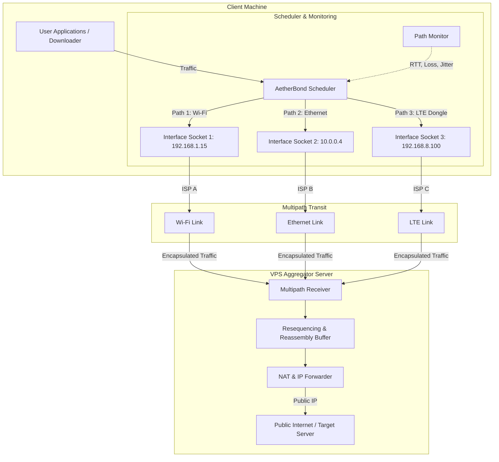
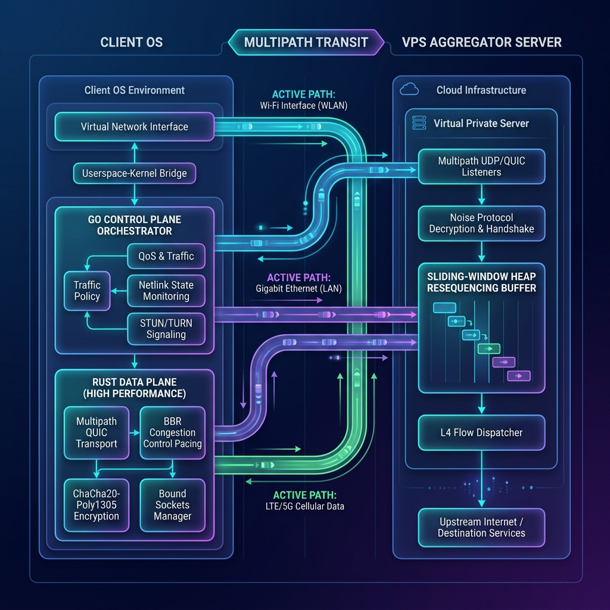

# AetherBond System Architecture Diagram

This document contains the core system architecture diagram for **AetherBond**, showing the client machine, multipath transit lanes, and the VPS aggregator server.

## Mermaid Source Diagram

## Visual Representation

Below is the rendered high-fidelity system diagram:

